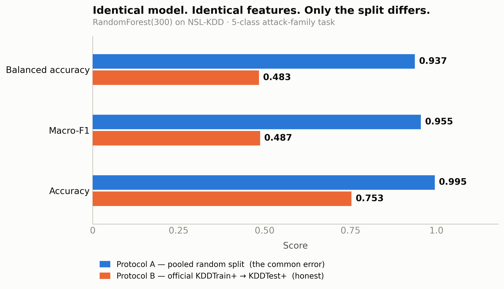
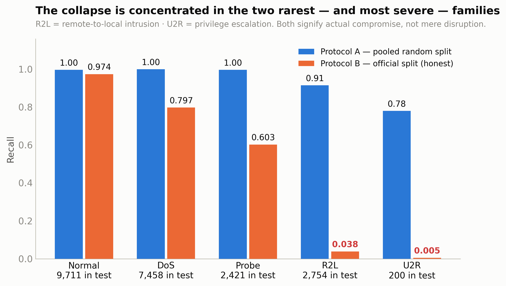
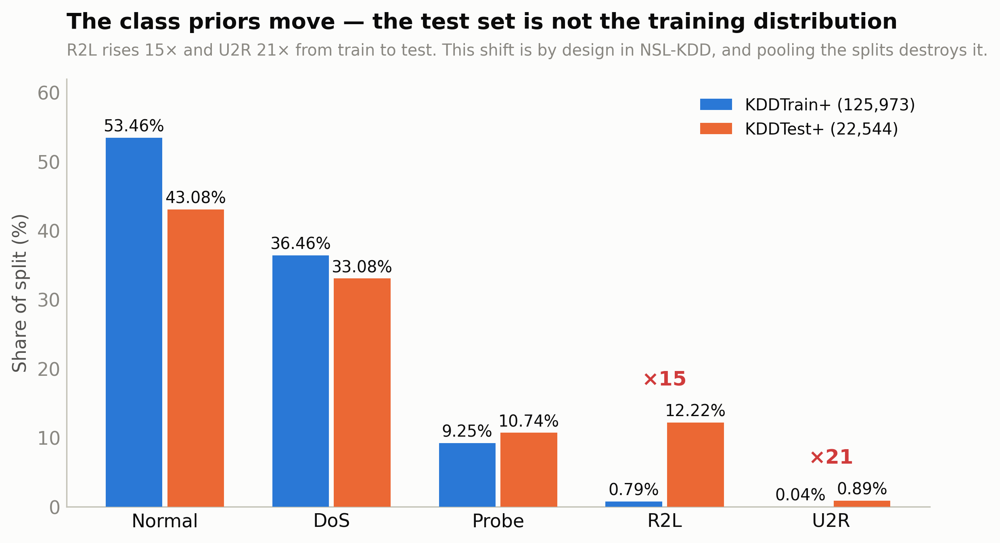
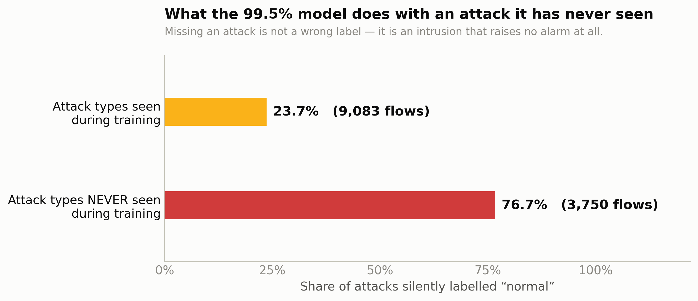
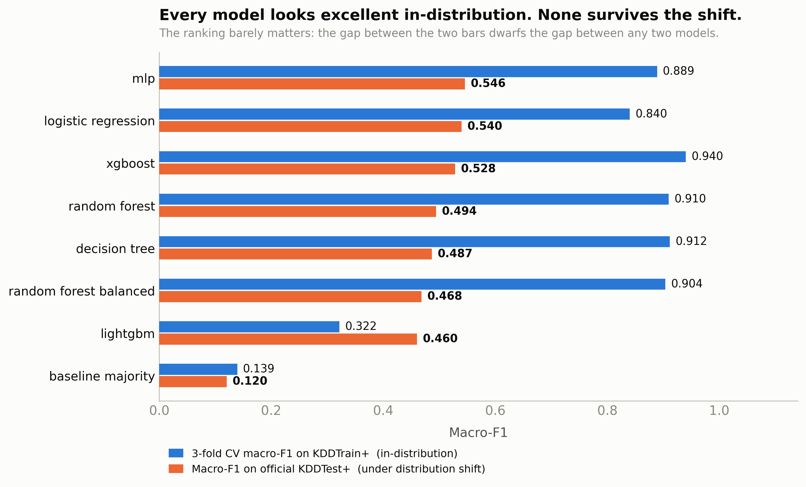
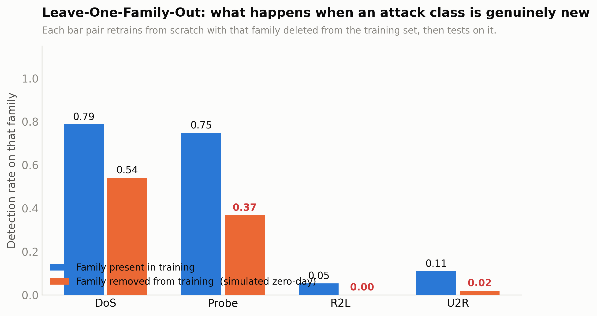
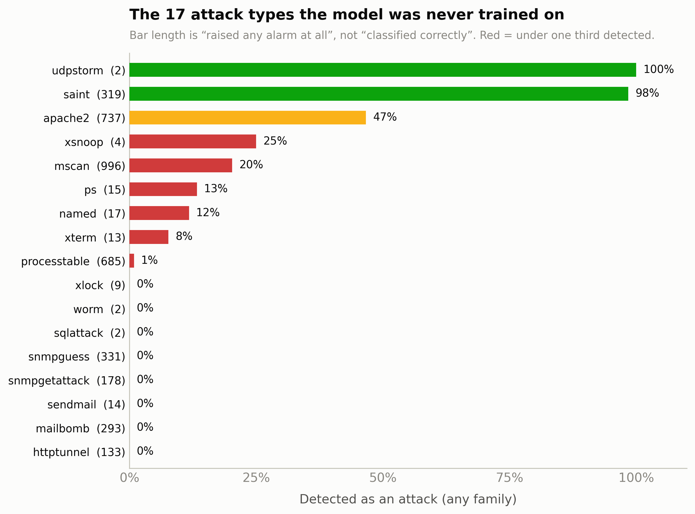
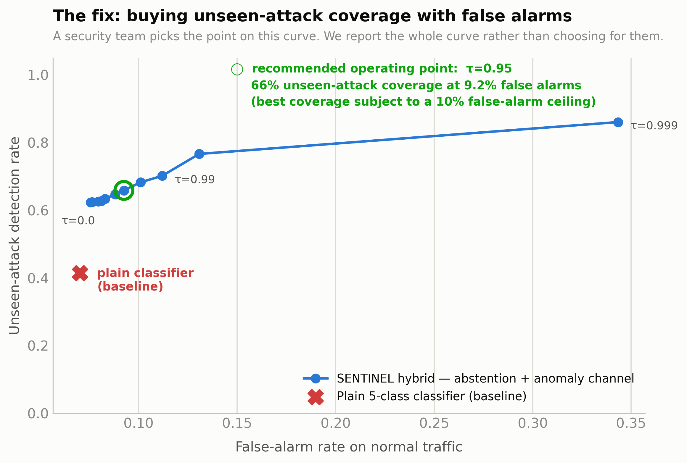

<h1 align="center">SENTINEL-NIDS</h1>

<p align="center">
  <strong>Network intrusion detection for critical infrastructure — evaluated honestly.</strong>
</p>

<p align="center">
  
  
  
  
  
</p>

<p align="center">
  Submission for <strong>ML Bubble 2026</strong> · Army Institute of Technology (AIT), Pune<br>
  Track <strong>TE-BE (Design &amp; Solve — Advanced)</strong> 
</p>

---

## TL;DR

> Machine-learning intrusion detectors are widely reported at **97–99% accuracy**.
> Holding the model, features, hyperparameters and seed constant and changing **only the
> train/test split**, accuracy falls to **75.28%** and macro-F1 from **0.955 to 0.487** —
> a **50× higher error rate**. Under honest evaluation the detector silently labels
> **76.7% of never-before-seen attacks as "normal"**.
>
> This repo proves that with a controlled experiment, then fixes a large part of it.

| | Reported (pooled random split) | Honest (official split) |
|---|---|---|
| **Accuracy** | 0.9951 | **0.7528** |
| **Macro-F1** | 0.9548 | **0.4869** |
| **Privilege-escalation (U2R) recall** | 0.780 | **0.005** |
| **Unseen attacks cleared as "normal"** | — | **76.7%** |

```bash
pip install -r requirements.txt
python run_all.py --only leakage      # ~35 s — reproduces the table above
```

## Contents

- [The one-paragraph version](#the-one-paragraph-version)
- [Headline result](#headline-result)
- [Comparative analysis — 8 configurations](#comparative-analysis--8-configurations-identical-splits)
- [Zero-day evaluation](#zero-day-evaluation)
- [The fix — a two-channel detector](#the-fix--a-two-channel-detector-with-abstention)
- [Deployment considerations](#deployment-considerations--measured-not-asserted)
- [Explainability](#explainability)
- [Reproduce everything](#reproduce-everything)
- [Repository layout](#repository-layout)
- [What this project does *not* claim](#what-this-project-does-not-claim)
- [Documentation index](#documentation-index)
- [License & attribution](#license--attribution)

---

## The one-paragraph version

The machine-learning intrusion-detection literature routinely reports 97–99% accuracy. This
project shows that **those numbers are largely an artefact of how the data is split**, and that a
detector built on them is blind to exactly the attacks that matter most. Using one model, one
feature pipeline and one hyperparameter set — changing *only* the train/test split — accuracy
moves from **99.51% to 75.28%** and macro-F1 from **0.955 to 0.487**. Under the honest protocol
the detector misses **76.7% of attack types it was never trained on**, silently labelling them
"normal". We then fix a large part of that: a two-channel detector with explicit abstention
raises unseen-attack coverage from **41.5% to 65.9%** for **2.2 percentage points** of extra
false alarms, and ships at **0.013 ms per flow** in a **4.9 KB** ONNX model.

> **The claim is falsifiable and the experiment is one command.** That is the point.

---

## Headline result

Identical `RandomForestClassifier(n_estimators=200)`, identical 122 one-hot features, identical
seed. **Only the split differs.**

| | Protocol A — pooled train+test, random 80/20 | Protocol B — official `KDDTrain+` → `KDDTest+` |
|---|---|---|
| Accuracy | **0.9951** | **0.7528** |
| Macro-F1 | **0.9548** | **0.4869** |
| Balanced accuracy | 0.9373 | 0.4835 |

**Gap: 24.23 accuracy points, 46.79 macro-F1 points. The error rate is 50.4× higher under honest
evaluation.**

Protocol A is what a great many tutorials, blog posts and student projects do — concatenate the
two provided files and call `train_test_split`. Protocol B is what the dataset authors designed.



### Where the collapse happens

| Attack family | Recall (Protocol A) | Recall (Protocol B) | Test support |
|---|---|---|---|
| Normal | 0.997 | 0.974 | 9,711 |
| DoS — denial of service | 0.999 | 0.797 | 7,458 |
| Probe — scanning | 0.996 | 0.603 | 2,421 |
| **R2L — remote-to-local intrusion** | 0.915 | **0.038** | 2,754 |
| **U2R — privilege escalation** | 0.780 | **0.005** | 200 |

R2L and U2R are the categories that mean *an attacker got in*, as opposed to merely disrupting
service. Under honest evaluation the detector finds essentially none of them.



### Why: the test set is not the training distribution

NSL-KDD ships with a **designed** train/test shift. Two properties, both destroyed by pooling:

1. **17 of the 37 attack types occur only in the test set** — 3,750 records, **16.6% of the test
   set** — so the model must generalise to attacks it has never observed.
2. **The class priors move.** R2L is 0.79% of training data but **12.2%** of test data (**15.5×**);
   U2R moves 0.04% → 0.89% (**21.5×**).



### The operational consequence

A missed attack is not a mislabelled row — it is an intrusion that raises **no alarm at all**.

| | Share silently labelled "normal" |
|---|---|
| Attack types seen in training (9,083 flows) | 23.7% |
| **Attack types never seen in training (3,750 flows)** | **76.7%** |



---

## Comparative analysis — 8 configurations, identical splits

Metric of record is **macro-F1 on the official test split**, not accuracy. A model that ignores
R2L and U2R entirely can still reach 86.9% accuracy on the official test split — those two
families are only 13.1% of it.

| Model | Macro-F1 (test) | Accuracy | 3-fold CV macro-F1 (train) | Shift penalty | Detect | FAR | R2L recall | U2R recall | Unseen missed |
|---|---|---|---|---|---|---|---|---|---|
| **07 MLP (128,64)** | **0.5460** | 0.7812 | 0.889 | 0.343 | 0.700 | 0.042 | 0.106 | 0.080 | **0.507** |
| 01 Logistic regression | 0.5399 | 0.7650 | 0.840 | 0.300 | 0.658 | 0.070 | 0.037 | 0.105 | 0.581 |
| 05 XGBoost | 0.5284 | 0.7766 | 0.940 | 0.412 | 0.658 | 0.028 | 0.060 | 0.055 | 0.619 |
| 03 Random forest | 0.4944 | 0.7566 | 0.910 | 0.415 | 0.614 | 0.026 | 0.048 | 0.010 | 0.757 |
| 02 Decision tree | 0.4869 | 0.7485 | 0.912 | 0.425 | 0.689 | 0.077 | 0.069 | 0.030 | 0.588 |
| 04 Random forest (balanced) | 0.4684 | 0.7366 | 0.904 | 0.435 | 0.573 | 0.026 | 0.005 | 0.005 | 0.865 |
| 06 LightGBM | 0.4603 | 0.6941 | 0.322 | −0.138 | 0.544 | 0.049 | 0.047 | 0.000 | 0.759 |
| 00 Majority baseline | 0.1204 | 0.4308 | 0.139 | 0.019 | 0.000 | 0.000 | 0.000 | 0.000 | 1.000 |



**Three findings that survive scrutiny:**

1. **The protocol dominates the model.** Six of the seven non-trivial models score 0.84–0.94 macro-F1
   in-distribution (LightGBM is the outlier — see the note below) and every one lands at
   0.46–0.55 under shift. The gap between the two columns (~0.40) is far
   larger than the gap between the best and worst real model (~0.09). Architecture choice is
   second-order; evaluation design is first-order.
2. **Model capacity does not help, and sometimes hurts.** The two simplest models —
   a 2-layer MLP and plain logistic regression — generalise *best* under shift. XGBoost has the
   highest in-distribution CV score (0.940) and a worse test score than logistic regression.
   Higher capacity buys a better fit to a distribution that is not the one being tested.
3. **Naive rebalancing makes it worse.** `class_weight="balanced_subsample"` *reduced* macro-F1
   from 0.494 to 0.468 and pushed R2L recall from 0.048 down to 0.005. Reweighting the loss
   cannot manufacture information about attack types absent from training. This is worth stating
   because rebalancing is the standard reflex for this dataset.

*(LightGBM's negative shift penalty is an artefact, not a virtue: with `num_leaves=63` it
collapses on the rare classes inside the small CV folds, giving an unusually low in-distribution
score. Its absolute test performance is the worst of the real models. Reported as measured.)*

---

## Zero-day evaluation

### Leave-One-Family-Out (controlled)

Each attack family is deleted from training entirely, the model is refitted from scratch, and then
tested on the family it has never seen.

| Family removed | Detection when present | Detection when held out | Loss |
|---|---|---|---|
| DoS | 0.788 | 0.542 | −0.246 |
| Probe | 0.749 | **0.369** | −0.380 |
| R2L | 0.053 | **0.001** | −0.053 |
| U2R | 0.110 | **0.020** | −0.090 |



### Per-attack-type behaviour on the 17 unseen types



---

## The fix — a two-channel detector with abstention

**Diagnosis.** A softmax over five known classes has no way to express *"this is none of these."*
Forced to choose, it picks the class with the largest prior mass — `Normal`. The failure is
structural, not a tuning problem.

**Architecture.**

```
                    ┌─ Channel A: supervised classifier (logistic regression)
   flow features ───┤     └─ if max P(class) < τ  →  ABSTAIN, do not clear the flow
                    └─ Channel B: IsolationForest fitted on NORMAL TRAFFIC ONLY
                                  (never sees a single attack in training)

   alarm = A says attack  OR  A abstains  OR  B says outlier
   verdict ∈ { NORMAL, ATTACK:<family>, SUSPICIOUS_UNCLASSIFIED }
```

**Ablation** (official test split):

| Configuration | Unseen-attack detection | Seen-attack detection | False-alarm rate |
|---|---|---|---|
| Channel A alone (plain classifier) | 0.415 | 0.756 | 0.070 |
| **Channel B alone (zero attacks in training)** | **0.566** | 0.638 | **0.020** |
| A OR B, no abstention | 0.624 | 0.770 | 0.076 |
| **A + abstention (τ=0.95) OR B — recommended** | **0.659** | 0.805 | 0.093 |
| A + abstention (τ=0.999) OR B | 0.861 | 0.977 | 0.343 |

**Net result: unseen-attack coverage 41.5% → 65.9% for +2.2 points of false alarms.**



The most interesting row is the second. **An unsupervised model that never saw a single attack
detects unseen attacks better than the supervised classifier does (0.566 vs 0.415), at under a
third of the false-alarm rate.** That is direct evidence that the supervised model's failure on
novel attacks is not a lack of capacity — it is that supervision on 22 known attack types actively
misleads it about the 17 it has not seen.

We report the whole operating curve rather than picking a threshold. τ is a policy decision that
belongs to whoever staffs the alert queue; the recommended point is simply "best unseen-attack
coverage subject to a 10% false-alarm ceiling."

---

## Deployment considerations — measured, not asserted

An IDS is latency-bound: it must classify a flow before the next one arrives. Measured on the
build container (2 vCPU x86_64, single-threaded for ONNX):

| Model | p50 latency / flow | p99 | Model size | Throughput (batch 4096) |
|---|---|---|---|---|
| **ONNX Runtime (logistic regression)** | **0.013 ms** | 0.045 ms | **4.9 KB** | **809,931 flows/s** |
| Decision tree | 0.079 ms | 0.183 ms | 51.8 KB | 5,072,935 flows/s |
| Logistic regression (sklearn) | 0.215 ms | 0.398 ms | 11.3 KB | 640,085 flows/s |
| MLP (sklearn) | 0.362 ms | 0.474 ms | 774.9 KB | 443,088 flows/s |
| XGBoost | 0.968 ms | 1.442 ms | 3.3 MB | 68,494 flows/s |
| LightGBM | 1.046 ms | 2.903 ms | 3.2 MB | 52,199 flows/s |
| **Random forest** | **65.206 ms** | 85.493 ms | **38.4 MB** | 31,428 flows/s |

**The fourth finding, and the most practically useful:** Random Forest — the reflexive choice for
this dataset — is **5,055× slower per flow and 8,027× larger on disk** than logistic regression
exported to ONNX, while scoring **0.05 lower** macro-F1. On a per-flow serving path it is simply
not deployable at line rate on commodity hardware. The model that is best on the metric of record
is also the cheapest to run.

Full deployment notes — serving topology, drift monitoring, retraining triggers, failure modes and
what we would need before putting this near a real network — are in **[docs/DEPLOYMENT.md](docs/DEPLOYMENT.md)**.

---

## Explainability

Round 2 is a *Model Explanation Round*, so interpretability is a first-class requirement rather
than a garnish. Two attributions, answering different questions:

- **Permutation importance** on the official test split — "which features does the deployed model
  actually rely on when it faces shifted traffic?" (measured as macro-F1 drop when a feature is
  shuffled) → `reports/figures/fig10_permutation_importance.png`
- **SHAP per attack family** — "for *this* flow, what pushed the model to this verdict?"
  → `reports/figures/fig11_shap_by_family.png`

Every driver reduces to a named network behaviour (`src_bytes`, `same_srv_rate`,
`dst_host_srv_count`) rather than "feature 47" — which is what makes the model defensible under
questioning. Details in **[docs/METHODOLOGY.md](docs/METHODOLOGY.md)**.

---

## Reproduce everything

```bash
git clone https://github.com/manojk909/SENTINEL-NIDS.git && cd SENTINEL-NIDS
pip install -r requirements.txt

python run_all.py            # full pipeline, ~12 min on 2 vCPU
```

> **This was verified, not assumed.** The repository was cloned into an empty directory, the
> committed `leakage_experiment.json` deleted, and `python run_all.py --only leakage` run from
> scratch. It downloaded the dataset, retrained, and produced **bit-identical** numbers in 46
> seconds — same accuracy, macro-F1, balanced accuracy, gap and per-class recall.
>
> That test found a real bug first: the data stage was keyed on a file that ships in the repo, so
> a fresh clone skipped the download and every later stage crashed while the pipeline still
> printed "all stages complete". Fixed in [`7b60890`](../../commit/7b60890).

Or stage by stage:

```bash
cd src
python data.py                  # download + SHA-256 verify + summarise   (idempotent)
python experiment_leakage.py    # THE headline experiment                 (~35 s)
python experiment_models.py     # 8 models, per-model checkpoints         (~7 min)
python experiment_zeroday.py    # LOFO + the two-channel fix              (~3 min)
python explain.py               # permutation importance + SHAP           (~4 min)
python deploy_benchmark.py      # latency, throughput, ONNX export        (~2 min)
python plots.py                 # all 12 figures                         (~20 s)
```

Every stage is **idempotent and checkpointed** — completed work is detected and skipped, so an
interrupted run resumes instead of restarting. Raw data is not committed (28 MB); `src/data.py`
fetches it and writes SHA-256 hashes to `data/raw/manifest.json` so you can verify byte equality.

Serve the model:

```bash
pip install fastapi uvicorn
uvicorn app.service:app --port 8000
python app/service.py            # or: CLI smoke test, no HTTP needed
```

---

## Repository layout

```
sentinel-nids/
├── README.md                       ← you are here
├── run_all.py                      one-command reproduction
├── requirements.txt                pinned to verified versions
├── src/
│   ├── config.py                   paths, seed, feature names, attack-family map
│   ├── data.py                     download, verify, encode (train-vocab only)
│   ├── experiment_leakage.py       Protocol A vs Protocol B
│   ├── experiment_models.py        8-model comparative analysis
│   ├── experiment_zeroday.py       LOFO + abstention/anomaly hybrid
│   ├── explain.py                  permutation importance + SHAP
│   ├── deploy_benchmark.py         latency, throughput, ONNX export
│   └── plots.py                    all figures
├── app/service.py                  FastAPI inference service (3-way verdict)
├── data/README.md                  provenance, schema, licence, limitations
├── docs/
│   ├── PROBLEM_STATEMENT.md
│   ├── METHODOLOGY.md              every design decision + why
│   ├── MODEL_CARD.md               intended use, limits, what it must NOT be used for
│   ├── DEPLOYMENT.md               serving, drift, retraining, failure modes
├── models/                         fitted estimators + sentinel_best.onnx
└── reports/
    ├── figures/                    12 figures (PNG 300 dpi + SVG)
    └── metrics/                    every number in this README, as JSON
```

**Every number in this README is reproduced from a JSON file in `reports/metrics/`.** Nothing was
typed by hand.

---

## What this project does *not* claim

It does not claim a state-of-the-art intrusion detector. It claims that a specific, identifiable
evaluation error inflates reported performance, demonstrates that with a controlled experiment,
measures the operational cost, and delivers a partial remedy whose limits are stated.

Honest limitations, stated here rather than buried:

- **NSL-KDD is 1999-era traffic.** Protocol mix, encryption rates and attack tooling have all
  changed. The *methodological* finding transfers to any dataset with a designed train/test shift;
  the *absolute numbers* should not be read as 2026 operational performance. UNSW-NB15,
  CIC-IDS2017 and HuggingFace-hosted NIDS corpora were all attempted and are unreachable from the
  build environment (verified: 403 at the proxy).
- **Even the fixed detector misses 34% of unseen attacks** at the recommended operating point.
  That is a real gap, not a rounding error.
- **R2L and U2R remain poorly detected** (best-case recall 0.106 for R2L and 0.105 for U2R,
  across all eight models). We show why —
  0.83% of training data between them, and a 15–21× prior shift — but we do not solve it.
- **Feature extraction, not inference, is the real production cost.** Our latency numbers measure
  model inference on pre-computed flow aggregates. Computing those aggregates from a live packet
  stream is the harder engineering problem and is out of scope here.

---

## Documentation index

| Document | What it covers |
|---|---|
| [`docs/PROBLEM_STATEMENT.md`](docs/PROBLEM_STATEMENT.md) | The problem, the hypothesis, why this dataset can test it |
| [`docs/METHODOLOGY.md`](docs/METHODOLOGY.md) | Every design decision and why — split protocol, encoding, metric choice, threats to validity |
| [`docs/MODEL_CARD.md`](docs/MODEL_CARD.md) | Intended use, measured performance, and an explicit **do-not-use-for** list |
| [`docs/DEPLOYMENT.md`](docs/DEPLOYMENT.md) | Serving architecture, threshold policy, drift monitoring, failure modes |
| [`data/README.md`](data/README.md) | Dataset provenance, licence, schema, SHA-256 manifest, limitations |
| [`reports/metrics/`](reports/metrics) | Every number in this README, as JSON |

## Results index

All figures are generated by [`src/plots.py`](src/plots.py) and
[`src/plot_deck_extras.py`](src/plot_deck_extras.py).

| Figure | Shows |
|---|---|
| `fig1_leakage_gap` | The headline gap between the two protocols |
| `fig2_per_class_recall` | Where the collapse lands, per attack family |
| `fig3_class_prior_shift` | Train vs test class priors (the 15×/21× shift) |
| `fig4_novel_vs_seen` | Unseen vs seen attacks cleared as "normal" |
| `fig5_model_comparison` | 8 models, in-distribution vs under shift |
| `fig6_confusion_matrix` | Row-normalised confusion under the honest protocol |
| `fig7_per_novel_attack` | Detection rate for each of the 17 unseen attack types |
| `fig8_hybrid_operating_curve` | The fix: coverage bought per false alarm |
| `fig9_lofo` | Leave-one-family-out controlled zero-day |
| `fig10_permutation_importance` | What the deployed model actually relies on |
| `fig11_shap_by_family` · `fig12_shap_r2l_u2r_deck` | Per-family SHAP attribution |

---

## License & attribution

**Code and documentation** in this repository are released under the
[MIT License](LICENSE) — © 2026 Manoj Kharkar.

**Dataset.** NSL-KDD, from M. Tavallaee, E. Bagheri, W. Lu and A. A. Ghorbani,
*"A Detailed Analysis of the KDD CUP 99 Data Set"*, IEEE Symposium on Computational Intelligence
for Security and Defense Applications (CISDA), 2009 — Canadian Institute for Cybersecurity,
University of New Brunswick. Used here for non-commercial academic purposes with attribution.
The dataset is **not** redistributed in this repository; [`src/data.py`](src/data.py) fetches it and
records SHA-256 hashes. Full provenance and limitations: [`data/README.md`](data/README.md).

**Built with** scikit-learn, XGBoost, LightGBM, SHAP, ONNX Runtime, matplotlib, FastAPI.
